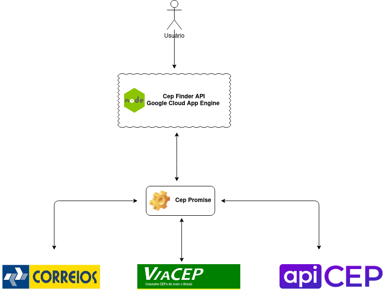
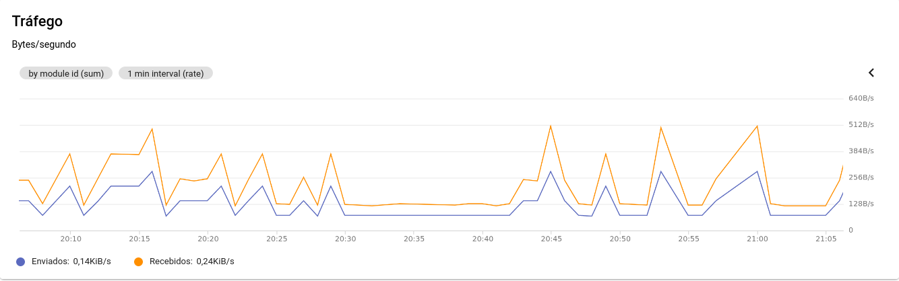
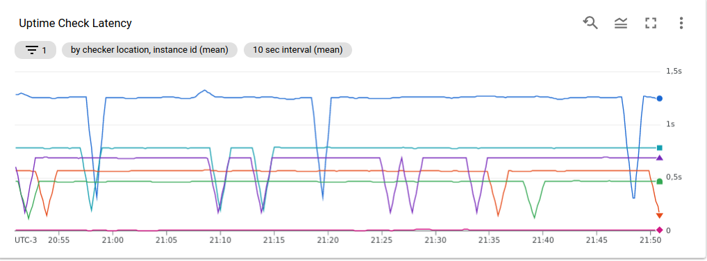
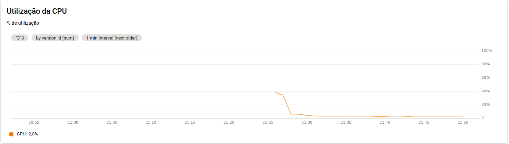
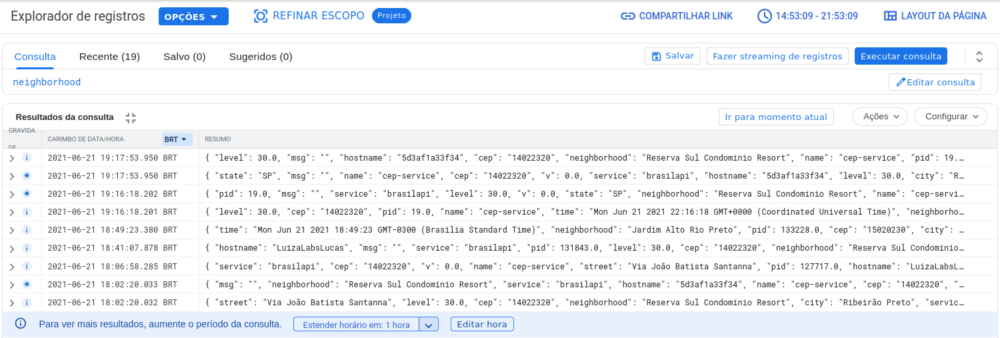
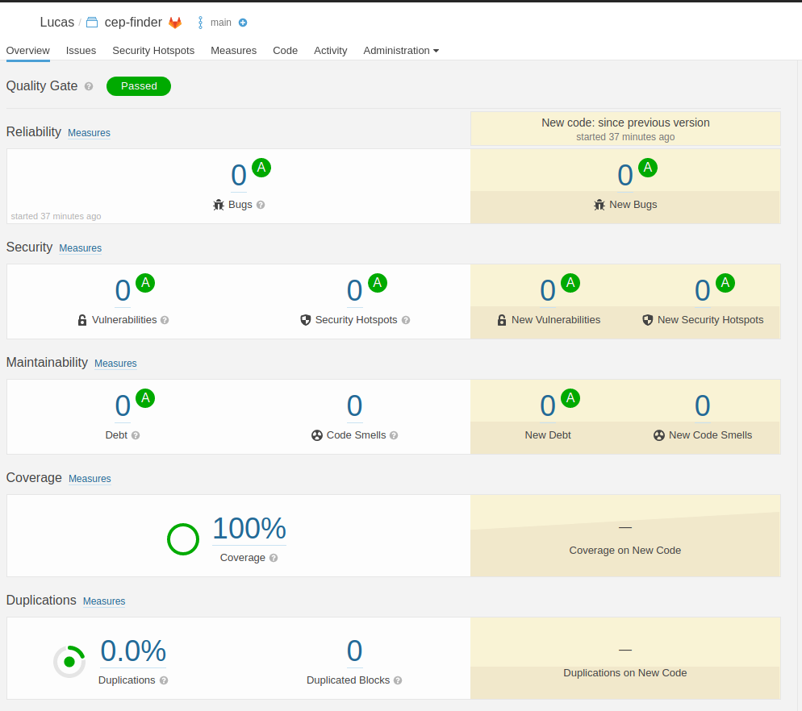

<h1 align="center">Cep Finder</h1>

<p>Cep Finder é uma api que realiza consulta de cep:</p>
<ol>
<li>Dado um CEP válido, retorna os dados do endereço:
<ul>
<li>cep</li>
<li>state</li>
<li>city</li>
<li>neighborhood</li>
<li>street</li>
<li>service</li>
</ul>
</li>
<li>Dado um CEP válido, que não possua endereço, a api substitui os valores da direita pra esquerda por 0, até achar um cep com endereço. Realiza até 4 tentativas (incluindo o dado original), caso não encontrar, retorna erro. Exemplo: Dado 14050999 tentar com 14050990, 14050900 e 14050000.</li>
<li>Dado um CEP inválido retorna uma mensagem de erro "CEP INVÁLIDO".</li>
</ol>

<h1 align="center">Proposta</h1>

<p>Graças a engine <a href=https://github.com/BrasilAPI/cep-promise>Cep Promise</a> é possível realizar a busca de CEP integrado diretamente ao serviço dos Correios, Viacep e Widenet (Apicep)</p>

</img>

<h1 align="center">Arquitetura</h1>
<p>A aplicação foi desenvolvida utilizando MVC para API REST com divisões e organização por diretórios. Assim temos um ganho na reutilização de códigos e fácil manutenção.</p>
<ul><b>Tecnologias Utilidadas:</b>
<li>NodeJs</li>
<li>Npm</li>
<li>Swagger</li>
<li>Test com jEst</li>
<li>Google Cloud Plataform</li>
<li>SonarCloud</li>
</ul>

<h1 align="center">Node.js</h1>

<p>Tecnologia utilizada como principal linguagem de programação. Por ser leve e multiplataforma é possível rodar a aplicação em qualquer servidor com a SO desejada, diminuindo muito o custo de hardware.</p>

<h1 align="center">Swagger</h1>

<p>Estrutura para documentação da API. Com o Swagger os endpoints são facilmente acessados pelo navegador.</p>

<h1 align="center">Executando a API</h1>

<p>Pré-requisitos</p>
<ul>
<li>Realizar o clone do projeto</li>
<li>Node >= 12.0.0</li>
<li>Npm</li>
<ul>

<p><br>Variáveis de ambiente</p>

| Nome                                            | Descrição                                                                                            |
| ------------------------------------------------| ---------------------------------------------------------------------------------------------------- |
| HOST                              | URL da aplicação             |
| PORT                               | Porta da aplicação                              |
| AUTHORIZATION                               | Indica se a aplicação vai usar o serviço de autenticação                              |
| GCLOUD_TYPE   | Tipo do projeto  |
| GCLOUD_PROJECT   | Id do projeto no google cloud  |
| GCLOUD_PRIVATE_KEY_ID   | Id da chave privada  |
| GCLOUD_PRIVATE_KEY   | Chave privada  |
| GCLOUD_CLIENT_EMAIL   | E-mail do client  |
| GCLOUD_CLIENT_ID     | Id do client  |
| GOOGLE_APPLICATION_CREDENTIALS  | Caminho do arquivo de autenticação do google cloud  |


<p>Instação</p>

```sh
npm install
```

<p>Testes</p>

```sh
npm test
```

<p>Executar o projeto</p>

```sh
npm start
```

<h1 align="center">Google App Engine</h1>
<p>Serviço de nuvem oferecido pela Google com toda arquitetura necessária para hospedagem da aplicação.</p>

<h1>Monitoramento</h1>

</img>

</img>

</img>

<h1>Log</h1>

</img>

<h1>SonarCloud</h1>
<p>Url do projeto cep-finder no SonarCloud: <a href="https://sonarcloud.io/dashboard?id=volgarini_cep-finder">Clique aqui</a></p>
</img>
